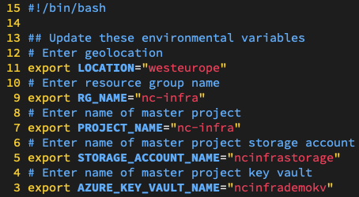
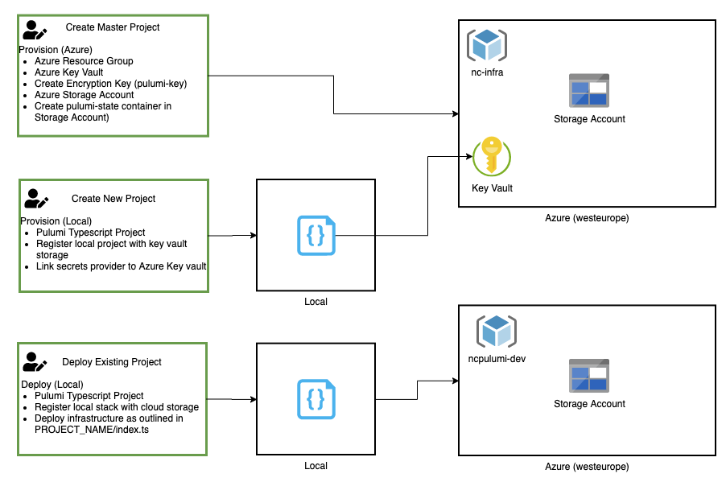

[](https://dev.azure.com/nc-azure-thomas-kim/Pulumi/_build/latest?definitionId=1&branchName=master)

# Pulumi Boilerplate

## Overview
This is a boilerplate project for the [Pulumi](https://pulumi.com) framework. This project uses pulumi in conjunction with Azure Storage for state persistence.

This project has been setup to run 
- Locally from a users local computer
- Through CI/CD using Azure Pipelines, please refer to [Azure DevOps documentation](./docs/pipelines.md) for further information

# Setup Instructions

## Required Tooling 

UNIX/Mac

- [Azure CLI](https://docs.microsoft.com/en-gb/cli/azure/install-azure-cli)
- [Jq](https://formulae.brew.sh/formula/jq)
- [Pulumi](https://formulae.brew.sh/formula/pulumi)


## Local Running Instructions

- Login through Azure CLI

- Update export variables in 1_init_pulumi.sh and 2_run_cmd.sh

- **Note** Please update default values to globally unique names i.e Keyvault etc.



- Open terminal and run 

```
sh 1_init_pulumi.sh
```

It is recommended to follow the menu options chronologically for a new project.



# Contributing

Pipelines trigger of heads feature, dev and master

e.g

```
feature/add-web-app
bugfix/remove-trailing-char
hotfix/fix-comma
```

# TODO
- Error handling to prevent overwriting existing key
- Extend Docker version and test for x86 Windows

